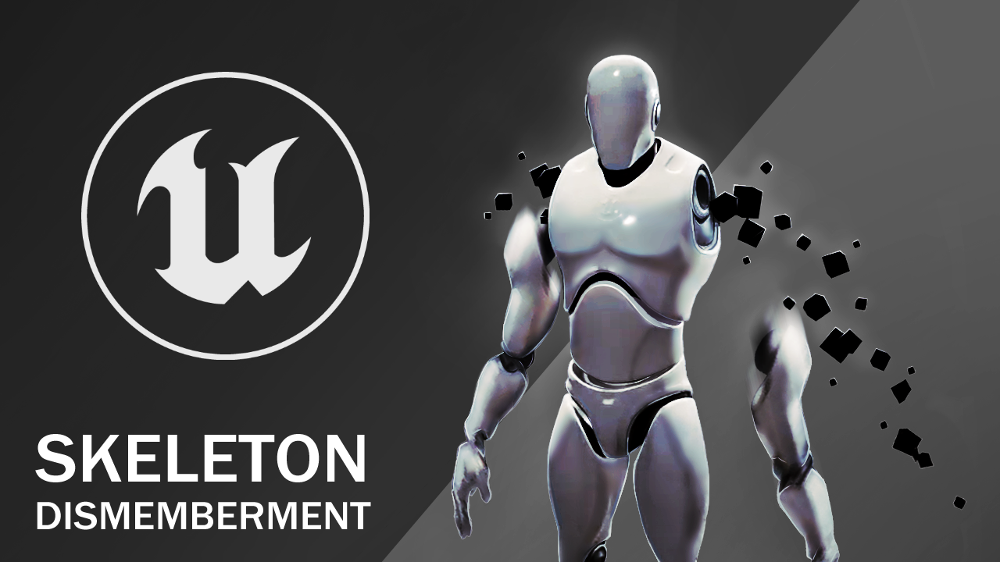

# Skeletal Dismemberment Unreal Plugin
This plugin was created as a proof of concept prototype for a passion project that was never started.
C++ & Blueprint
> [!WARNING]
> This Project was created in 2 weeks, as such will contain potential bugs and errors. Support is still avaliable if required, submit an issue.

Demo Video (https://youtu.be/GrP-dirN9D4)

## What is Skeletal Dismemberment

Dismemberment 
/dɪsˈmɛmbəm(ə)nt/ 
Noun 
1. 
The action of cutting off a person's or animal's limbs. 
"Graphic pictures of torture and dismemberment" 
 

This plugin mimics limb severance with a minimal gore level by spawning limbs and particle VFX on seperation.

## [OLD] Potential future improvements
> [!NOTE]
> There will be no further developments to this project, but the old planned list of features can be seen below

- Mesh Splicing
- Limb Caps (Exposed Bones)
- Ragdoll limbs
- Better Animation Transitions
- Bone Group Data Improvements (Enable / Disable Actions based on Limbs)
